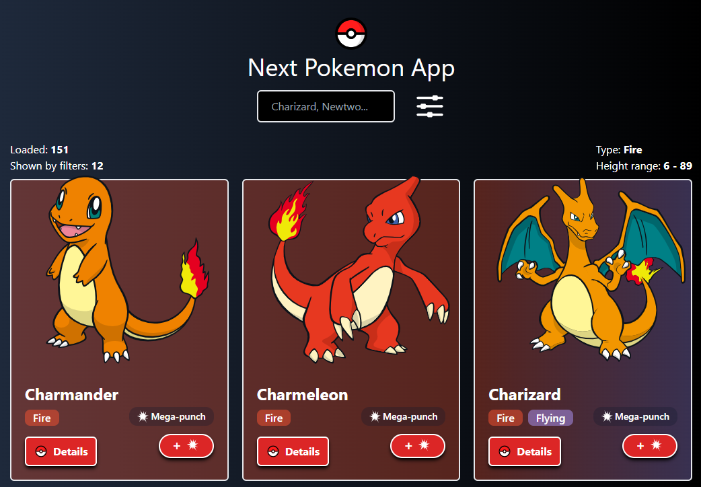

# Next Pokemon App
 
*Demo project made by Pedro Iván Gazulla Giménez*  

This web app is a Pokemon viewer made with Next.js. The grid that shows loaded Pokemons is CSR and the Pokemon details page is SSR.  

## To run the App (dev mode)
1. Make sure you have [Node.js](https://nodejs.org) installed.  
2. Download the source code from this repository.  
3. Extract the code to a directory.  
4. Open a terminal and enter to the project directory: "cd" command.  
5. Run: `npm install`
6. Run: `npm run dev`
7. Open [http://localhost:3000](http://localhost:3000) to view it in the browser.  
